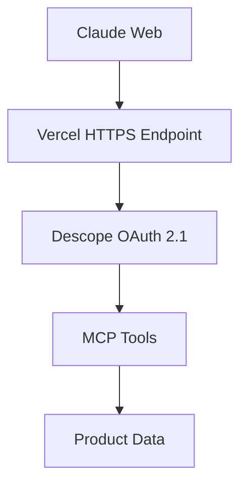

# Descope Store MCP Server

A Model Context Protocol (MCP) server with OAuth 2.1 authentication using Descope, ready for deployment on Vercel. Connects to the Descope Authentication Store for product data.

## 🚀 Quick Deploy to Vercel

[](https://vercel.com/new/clone?repository-url=https://github.com/your-username/descope-store-mcp&env=DESCOPE_PROJECT_ID,DESCOPE_MANAGEMENT_KEY&envDescription=Required%20environment%20variables%20for%20Descope%20authentication)

## 📋 Prerequisites

1. **Descope Account**: Sign up at [descope.com](https://descope.com)
2. **Vercel Account**: Sign up at [vercel.com](https://vercel.com)

## 🔧 Environment Variables

Set these in your Vercel dashboard or `.env` file:

```env
DESCOPE_PROJECT_ID=your_descope_project_id
DESCOPE_MANAGEMENT_KEY=your_descope_management_key
```

## 📦 Manual Deployment Steps

### 1. Install Vercel CLI

```bash
npm install -g vercel
```

### 2. Login to Vercel

```bash
vercel login
```

### 3. Deploy

```bash
vercel --prod
```

### 4. Set Environment Variables

```bash
vercel env add DESCOPE_PROJECT_ID
vercel env add DESCOPE_MANAGEMENT_KEY
```

### 5. Redeploy with Environment Variables

```bash
vercel --prod
```

## 🔗 Using Your Deployed MCP Server

Once deployed, your MCP server will be available at:

```
https://your-project-name.vercel.app
```

### MCP Endpoints

- **SSE Endpoint**: `https://your-project-name.vercel.app/sse`
- **Message Endpoint**: `https://your-project-name.vercel.app/message`
- **OAuth Metadata**: `https://your-project-name.vercel.app/.well-known/oauth-authorization-server`

### Add to Claude Web

1. Go to Claude Web
2. Add Connector
3. Enter your SSE endpoint URL
4. Complete OAuth authentication

## 🛠️ Available MCP Tools

- **search_products**: Search for Descope authentication products
- **get_product**: Get detailed product information
- **compare_products**: Compare multiple products side by side
- **get_store_info**: Get general store information

## 🏃‍♂️ Local Development

### Start Local HTTPS Server

```bash
npm run dev
```

Access at: `https://localhost:3443`

### Start Local HTTP Server (Testing)

```bash
node api/index.js
```

Access at: `http://localhost:3001`

## 🔐 Authentication

This MCP server uses:

- ✅ OAuth 2.1 compliant authentication
- ✅ Descope social login providers
- ✅ Scope-based access control
- ✅ Bearer token authentication
- ✅ PKCE (Proof Key for Code Exchange)

## 📁 Project Structure

```
descope-store-mcp/
├── api/
│   └── index.js          # Vercel serverless function
├── descope-mcp-server.js # Local development server
├── vercel.json           # Vercel configuration
├── package.json          # Dependencies
├── .env                  # Environment variables (local)
└── README.md            # This file
```

## 🔄 Architecture



## 🛡️ Security Features

- HTTPS required for all endpoints
- OAuth 2.1 with PKCE
- Scope-based authorization
- Bearer token validation
- CORS properly configured

## 📝 License

MIT License - see LICENSE file for details.

## 🆘 Support

- **Descope Documentation**: [docs.descope.com](https://docs.descope.com)
- **MCP Specification**: [modelcontextprotocol.io](https://modelcontextprotocol.io)
- **Vercel Documentation**: [vercel.com/docs](https://vercel.com/docs)